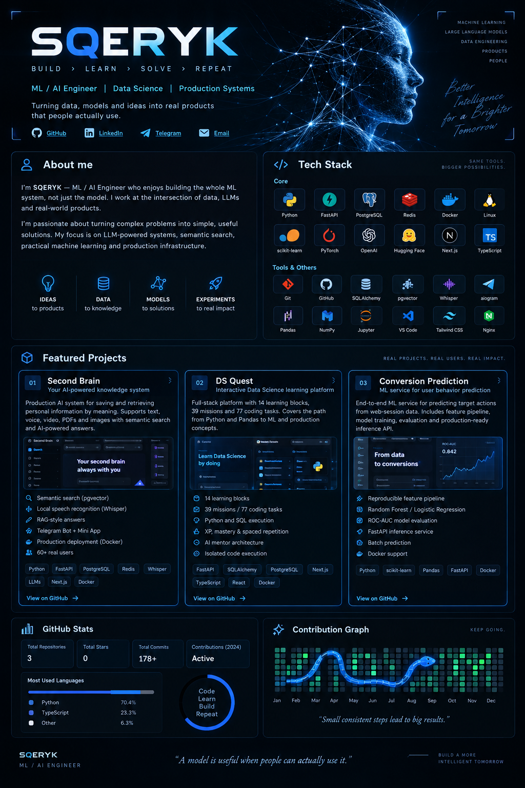

<div align="center">



### `I turn ML ideas into working products.`

Building intelligent systems around **LLMs, embeddings, data and production infrastructure**.

<br>

<a href="https://github.com/vaceslavkucenko8-code?tab=repositories">

</a>

</div>

<br>

## 👨‍💻 About me

```python
class SQERYK:
    role = "ML / AI Engineer"

    focus = [
        "Machine Learning",
        "LLM & RAG systems",
        "Semantic Search",
        "Data Science",
        "Production ML",
    ]

    engineering = [
        "FastAPI",
        "PostgreSQL / pgvector",
        "Redis",
        "Docker",
        "Async Python",
    ]

    philosophy = "A model is useful when people can actually use it."
```

I enjoy building the **whole ML system**, not just the model:

`data → experiments → model → API → infrastructure → product`

My main interests are semantic search, LLM-powered products, practical ML systems and turning messy data into useful software.

<br>

## 🧰 Tech

<div align="center">


<br><br>


</div>

<br>

## 🚀 Featured Projects

<table>
<tr>
<td width="50%" valign="top">

### 🧠 Second Brain

**Production AI knowledge system** for saving and retrieving personal information by meaning.

Supports text, voice, video, PDFs and images with semantic search and AI-powered answers.

**Highlights**

- 🔎 Semantic search with embeddings + pgvector
- 🎙️ Local speech recognition with Whisper
- 🤖 RAG-style answers over personal knowledge
- ⚡ Redis + background task processing
- 📱 Telegram Bot + Mini App
- 🐳 Production deployment with Docker
- 👥 60+ real users

**Stack**

`Python` `FastAPI` `PostgreSQL` `pgvector`  
`Redis` `Whisper` `LLMs` `Next.js`

<br>

[**→ Explore project**](https://github.com/vaceslavkucenko8-code/second-brain)

</td>

<td width="50%" valign="top">

### 🎓 DS Quest

**Interactive Data Science learning platform** with executable coding missions.

A full-stack platform covering the path from Python and Pandas to ML and production concepts.

**Highlights**

- 🗺️ 14 learning blocks
- 🎯 39 missions
- 💻 77 coding tasks
- 📈 XP, mastery & spaced repetition
- 🧪 Python and SQL execution
- 🤖 AI mentor architecture
- 🔐 Isolated code execution approach

**Stack**

`FastAPI` `SQLAlchemy` `PostgreSQL`  
`Next.js` `TypeScript` `React` `Docker`

<br>

[**→ Explore project**](https://github.com/vaceslavkucenko8-code/DS-roadmap)

</td>
</tr>

<tr>
<td width="50%" valign="top">

### 🚗 Conversion Prediction

End-to-end ML service for predicting target actions from web-session data.

**Highlights**

- 🧹 Reproducible feature pipeline
- 🌲 Random Forest / Logistic Regression
- 📊 ROC-AUC model evaluation
- 🔌 FastAPI inference service
- 📦 Batch prediction
- 🐳 Docker support
- ✅ Automated tests

**Stack**

`Python` `scikit-learn` `Pandas`  
`FastAPI` `Docker`

<br>

[**→ Explore project**](https://github.com/vaceslavkucenko8-code/avto-podpiska-for-sber)

</td>

<td width="50%" valign="top">

### 🔬 What's next?

Currently interested in building systems around:

<br>

**LLM Engineering**  
RAG · agents · structured outputs

**ML Systems**  
inference · evaluation · monitoring

**Search**  
embeddings · vector databases · ranking

**Data Science**  
experimentation · feature engineering · modeling

<br>

> Building things that survive outside a notebook.

</td>
</tr>
</table>

<br>

## 📊 GitHub

<div align="center">


</div>

<br>

<div align="center">

### 💭

> **Good ML isn't just a model with a high metric.  
> It's a system that reliably solves a real problem.**

<br>


</div>
