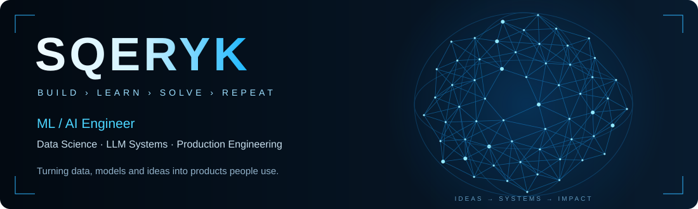

### `I turn ML ideas into working products.`

Building intelligent systems around **LLMs, embeddings, data and production infrastructure**.

 

 

## 👨‍💻 About me

I'm **SQERYK**, an **ML / AI Engineer** working at the intersection of **data, LLMs and real-world products**.

I enjoy building the **whole ML system**, not just the model:

`data → experiments → model → API → infrastructure → product`

My main interests are semantic search, LLM-powered products, practical ML systems and turning messy data into useful software.

 

## 🧰 Tech

  

 

## 🚀 Featured Projects

**Real projects. Real users. Real impact.**

<table>
<tr>
<td width="33%" valign="top">

### 01 · Second Brain

**Production AI knowledge system** for saving and retrieving personal information by meaning.

Supports text, voice, video, PDFs and images with semantic search and AI-powered answers.

**Highlights**

- 🔎 Semantic search with embeddings + pgvector
- 🎙️ Local speech recognition with Whisper
- 🤖 RAG-style answers over personal knowledge
- ⚡ Redis + background task processing
- 📱 Telegram Bot + Mini App
- 🐳 Production deployment with Docker
- 👥 60+ real users

**Stack**

`Python` `FastAPI` `PostgreSQL` `pgvector`  
`Redis` `Whisper` `LLMs` `Next.js`

 

[**→ Explore project**](https://github.com/vaceslavkucenko8-code/second-brain)

</td>

<td width="33%" valign="top">

### 02 · DS Quest

**Interactive Data Science learning platform** with executable coding missions.

A full-stack platform covering the path from Python and Pandas to ML and production concepts.

**Highlights**

- 🗺️ 14 learning blocks
- 🎯 39 missions
- 💻 77 coding tasks
- 📈 XP, mastery & spaced repetition
- 🧪 Python and SQL execution
- 🤖 AI mentor architecture
- 🔐 Isolated code execution approach

**Stack**

`FastAPI` `SQLAlchemy` `PostgreSQL`  
`Next.js` `TypeScript` `React` `Docker`

 

[**→ Explore project**](https://github.com/vaceslavkucenko8-code/DS-roadmap)

</td>
<td width="33%" valign="top">

### 03 · Conversion Prediction

End-to-end ML service for predicting target actions from web-session data.

**Highlights**

- 🧹 Reproducible feature pipeline
- 🌲 Random Forest / Logistic Regression
- 📊 ROC-AUC model evaluation
- 🔌 FastAPI inference service
- 📦 Batch prediction
- 🐳 Docker support
- ✅ Automated tests

**Stack**

`Python` `scikit-learn` `Pandas`  
`FastAPI` `Docker`

 

[**→ Explore project**](https://github.com/vaceslavkucenko8-code/avto-podpiska-for-sber)

</td>

</tr>
</table>

 

## 🔬 Currently exploring

| LLM Engineering | ML Systems | Search |
| :--- | :--- | :--- |
| RAG · agents · structured outputs | Inference · evaluation · monitoring | Embeddings · vector databases · ranking |

 

## 📊 GitHub Activity

[**Explore my repositories →**](https://github.com/vaceslavkucenko8-code?tab=repositories)

My contribution graph and latest activity are shown below this README.

---

### “A model is useful when people can actually use it.”

**SQERYK · ML / AI Engineer**

Build a more intelligent tomorrow.

